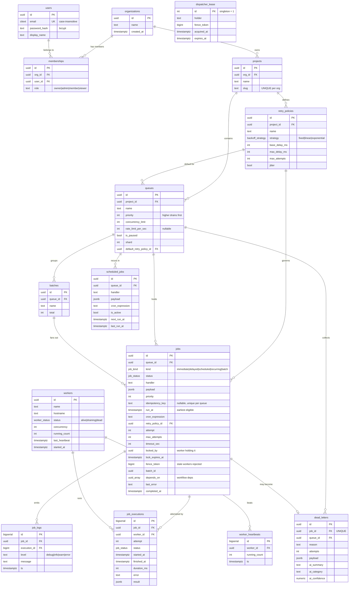

# AEGIS — Entity Relationship Diagram

The schema is multi-tenant and normalised to 3NF. The chain of ownership is:

```
organizations → projects → queues → jobs → job_executions → job_logs
```

Everything cascades on delete down that chain, so removing an organization
cleanly removes all of its data.

> The diagram below is written in [Mermaid](https://mermaid.js.org/). GitHub,
> GitLab, VS Code (with the Mermaid extension) and most Markdown viewers render
> it natively. The full DDL lives in [`db/schema.sql`](../db/schema.sql).



## Cardinality summary

| Relationship | Type | Delete behaviour |
|---|---|---|
| organization → project | 1 : N | CASCADE |
| organization → membership | 1 : N | CASCADE |
| user → membership | 1 : N | CASCADE |
| project → queue | 1 : N | CASCADE |
| project → retry_policy | 1 : N | CASCADE |
| queue → job | 1 : N | CASCADE |
| retry_policy → queue / job | 1 : N | SET NULL (policy deletion doesn't orphan work) |
| job → job_execution | 1 : N | CASCADE |
| job → job_log | 1 : N | CASCADE |
| job → dead_letter | 1 : 0..1 | CASCADE, `UNIQUE(job_id)` |
| worker → job_execution | 1 : N | SET NULL (keep history if a worker record is removed) |
| worker → worker_heartbeat | 1 : N | CASCADE |
| batch → job | 1 : N | (batch_id is a soft link, indexed) |

## Why it is normalised this way

- **Retry policies are their own table**, not columns on the queue, because one
  policy is reused by many queues *and* individual jobs can override it. This
  removes duplication and lets an operator retune backoff in one place.
- **`job_executions` is separate from `jobs`.** The `jobs` row is mutable state
  (current status, attempt counter); each *attempt* is an immutable fact. Keeping
  attempts in their own append-only table gives us free retry history and makes
  throughput/latency metrics a simple aggregate query without bloating the hot
  `jobs` row.
- **`scheduled_jobs` is separate from `jobs`.** A recurrence *definition* (cron)
  is edited and paused independently of the concrete runs it spawns. Materialising
  runs into `jobs` keeps the claim path uniform — the worker only ever reads one
  table.
- **`worker_heartbeats` is an append-only time series** distinct from the
  workers' latest `last_heartbeat`. The current value lives on `workers` for a
  cheap liveness check; the history table supports charts and post-mortems.
- **`dead_letters` is not just a status.** Although a job also carries the
  `dead_letter` status, the DLQ table stores the *why* (reason, attempt count,
  frozen payload, AI diagnosis) so the operator view and requeue flow don't have
  to reconstruct it.

See [DESIGN_DECISIONS.md](./DESIGN_DECISIONS.md) for indexing and concurrency
rationale.
